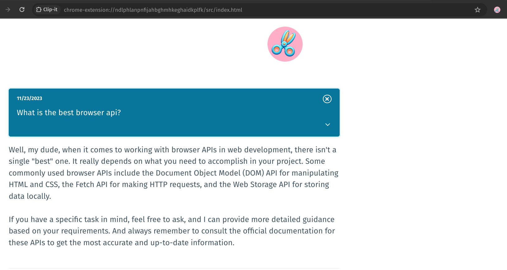
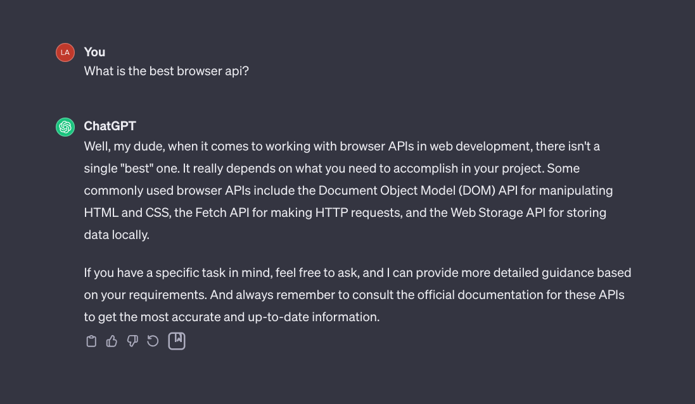

# Clip-it

 

  

### about

---

Clip-it is a Chrome extension that pins an icon onto ChatGPT interface, allowing users to save specific question and response blocks to browser storage for later reference. It was built as a small, personal project to learn about browser extensions and APIs. The icon tab interface was built with Preact and Pico CSS.

  

  

### installation

---

- Run `npm run build` at the root
- In Chrome, navigate to chrome://extensions
- In the top right enable the Developer mode toggle
- In the top left click Load unpacked and select the extracted `dist` directory

### to-do

---

- add default message when there are no clips
- refactor DOM detection polling and mutation detection mix
- icon color should change after click
- make the question text editable in the extension tab
